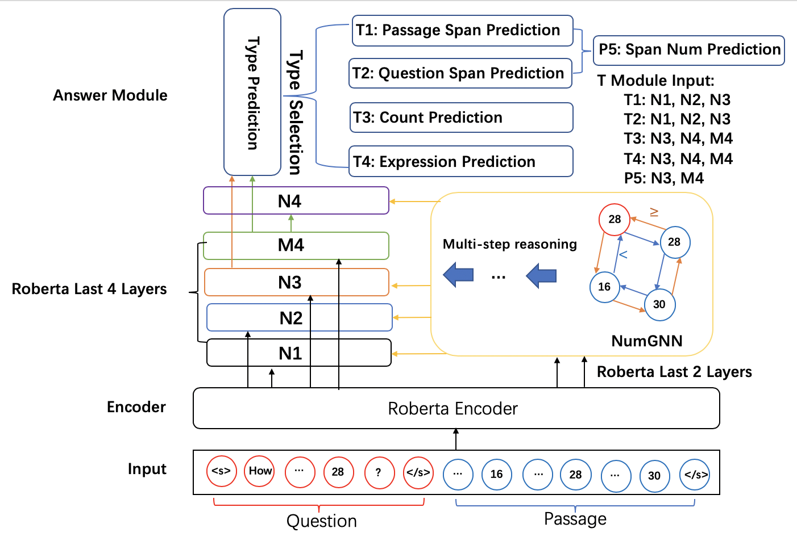

# NumNet+

This is the official code repository for NumNet+(https://leaderboard.allenai.org/drop/submission/bm60vq8f7g2p7t2ld0j0).
NumNet(https://github.com/ranqiu92/NumNet) was used as a basis for our work.



If you use the code, please cite the following paper:

```
@inproceedings{ran2019numnet,
  title={{NumNet}: Machine Reading Comprehension with Numerical Reasoning},
  author={Ran, Qiu and Lin, Yankai and Li, Peng and Zhou, Jie and Liu, Zhiyuan},
  booktitle={Proceedings of EMNLP},
  year={2019}
}
```

## Requirements

`pip install -r requirements.txt`

## Usage
### Data and pretrained roberta-large preparation.
- Download drop data.
  
  `wget -O drop_dataset.zip https://s3-us-west-2.amazonaws.com/allennlp/datasets/drop/drop_dataset.zip`
  
  `unzip drop_dataset.zip`

- Download roberta model.
 
  `cd drop_dataset && mkdir roberta.large && cd roberta.large `
  
  `wget -O pytorch_model.bin https://s3.amazonaws.com/models.huggingface.co/bert/roberta-large-pytorch_model.bin`

- Download roberta config file.
  
  `wget -O config.json https://s3.amazonaws.com/models.huggingface.co/bert/roberta-large-config.json`
  
- Download roberta vocab files.
  
  `wget -O vocab.json https://s3.amazonaws.com/models.huggingface.co/bert/roberta-large-vocab.json`
  
  `wget -O merges.txt https://s3.amazonaws.com/models.huggingface.co/bert/roberta-large-merges.txt`  
  
### Train 
`sh train.sh 345 5e-4 1e-4 5e-4 0.01`

### Eval
Save your model as model.pt.
    `sh eval.sh drop_dataset/drop_dataset_dev.json prediction.json`
    `python drop_eval.py --gold_path drop_dataset/drop_dataset_dev.json --prediction_path prediction.json`
